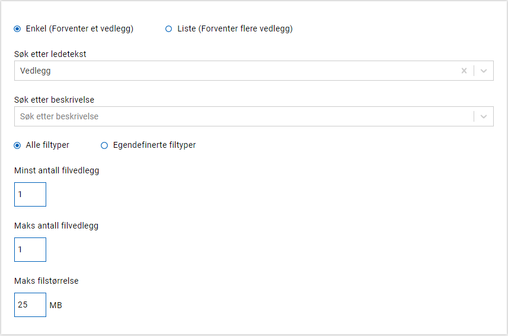
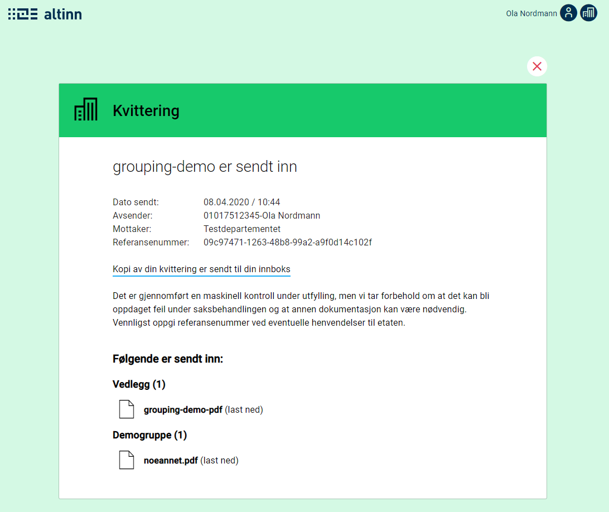

## Metoder for opplasting av vedlegg

I en Altinn app har man to alternativer for opplasting av vedlegg:

- vedleggskomponent i skjema
- API-kall mot app backend

Førstnevnte vil være et godt alternativ for all data er det forventet at en sluttbruker vil laste opp via brukergrensesnitt i skjema.
Sistnevnte anbefales brukt dersom det kun er forventet at systemer skal laste opp vedlegget.
Det er ingen begrensning på hvor mange vedlegg som kan inkluderes i en applikasjon
og begge opplastingsmetoder kan brukes innad i samme applikasjon.

Nedenfor følger en enkel beskrivelse av hvordan du kan legge til rette for at applikasjonen din kan ta imot vedlegg.

## Innsending av vedlegg med vedleggskomponent i skjema

Når man setter sammen skjemaet sitt i Altinn Studio har man en vedleggskomponent tilgjengelig.
Det er mulig å laste opp flere vedlegg på en enkelt komponent, og hvor mange vedleggskomponenter
du benytter i din applikasjon vil avgjøres av egenskapene til dokumentene du forventer at skal lastes opp
og eventuelle begrensninger du selv ønsker å sette
(se [konfigurasjon av vedlegg](#innsending-av-vedlegg-med-api-kall) for mer informasjon om dette).

NB! Det vil også være mulig å laste opp vedlegg av typen definert i vedleggkomponenten via API.



Bildet over viser vedleggskomponenten i Altinn Studio.
Det er mulig å sette en del av konfigurasjonenen for vedleggene som lastes opp alledere her.

1. Egendefinerte filtyper kan spesifiseres dersom man vil begrense filtypene som kan sendes inn.
En bruker vil i så fall hindres under opplastning dersom filtypen ikke er blant den godkjente listen.
2. Minst/maks antall filvedlegg kan spesifiseres dersom man ønsker et bestemt antall vedlegg lastet opp via komponenten.
Ved å sette '0' på _minst antall filvedlegg_ vil det ikke være påkrevd å laste opp en fil.
3. Maks filstørrelse spesifiseres i _MB_.

Ytterligere konfigurasjoner som kan settes for vedlegg inkluderer: tillatte bidragsytere og beskrivelse.
Dette gjøres i _applicationMetadata.json_ som ligger under App/config i applikasjonsrepoet.

## Innsending av vedlegg med API-kall

For å legge til rette for å kunne sende inn vedlegg uten å ha støtte for dette i GUI
må man legge inn et [datatype-objekt](https://docs.altinn.studio/teknologi/altinnstudio/architecture/components/application/solution/altinn-platform/storage/#datatype)
i _applicationMetadata.json_ (filen ligger under App/config i applikasjonsrepoet).
Det vil da kun være mulig å sende inn vedlegg av denne typen via API-kall.
For en nærmere beskrivelse av de tilgjengelige feltene se
[konfigurasjon av vedlegg](#innsending-av-vedlegg-med-api-kall).

## Konfigurasjon for vedlegg

I _applicationMetadata.json_ (ligger under App/config i applikasjonsrepoet) vil man finne en property som heter `dataTypes`.
Her er ligger konfigurasjonen for alle datatyper knyttet til applikasjonen,
både skjemadata (app model data) og vedlegg. Feltet _appLogic_ som man også vil se blant noen av objektene
i listen skal kun brukes for skjemadata.

Nedenfor er det to eksempler på  `dataTypes`-instanser i en applikasjon fra en deployet applikasjon.

```json
 "dataTypes": [
    {
      "id": "53a50f0d-2345-448d-9fba-f18e6bbe71f8",
      "taskId": "Task_1",
      "maxSize": 25,
      "maxCount": 1,
      "minCount": 1,
      "allowedContentTypes":["application/pdf"]
    },
    {
      "id": "attest",
      "taskId": "Task_1",
      "maxSize": 25,
      "maxCount": 1,
      "minCount": 0,
      "allowedContributers": ["org:nav", "orgNo:XXXXXXXXXX"],
      "grouping": "Attester",
    }
  ]
```

- **Id** på vedleggstypen.
Denne vil settes som en GUID dersom man bruker vedleggskomponent fra Altinn Studio slik man ser i det første elementet i dataTypes-listen.
Skulle det være ønskelig å endre verdien til et mer fornuftig navn må man også være obs på at denne endringen
må gjøres to steder: _applicationMetadata.json_ og _FormLayout.json_. (Kun relevant dersom man bruker filopplaster i GUI)

- **taskId** betegner hvilket steg i prosessen det er forventet at dette vedlegget skal lastes opp på.
Denne verdien må tilsvare en id på en av taskene i _process.bpmn_.

- **maxSize** betegner maks tillat størrelse på vedlegget.

- **maxCount** betegner en øvre grensen for hvor mange vedlegg av denne typen som skal lastet opp i tilknytning til en instans.

- **minCount** betegner en nedre grensen for hvor mange vedlegg av denne typen som skal lastet opp i tilknytning til en instans.
               Dersom verdien er 0 er det ikke påkrevt å laste opp vedlegg av denne typen.

- **allowedContributers** spesifiserer hvem som får lov til å lage og/eller endre vedlegg av denne typen.
Dette spesifiseres på formatet `{nøkkelord}:{verdi}`.
Tillatte nøkkelord inkluderer: 'org'; trebokstavsforkortelse på organisasjon og 'orgNo'; organisasjonsnummer.
Det er per nå ikke mulig å spesifisere en organisasjon som ikke er registrert som tjenesteeier.

- **allowedContentTypes** spefisiserer hvilke vedleggstyper man tillater.
De hyppigst brukte inkluderer: application/pdf, text/xml, image/jpeg. Dersom man ikke ønsker å sette begrensning på typen vedlegg trenger man ikke definere denne parameteren.
Les mer om mime types [her](https://developer.mozilla.org/en-US/docs/Web/HTTP/Basics_of_HTTP/MIME_types/Common_types).

- **grouping** betegner gruppen som vedleggene i av denne typen skal grupperes etter.
Dette er en valgfri egenskap, hvor vedlegg med samme grouping vil havne i samme liste. Grouping kan både være en streng (f.eks "Attester") eller en tekstnøkkel om man ønsker å støtte flere språk (f.eks "skjema.vedleggsgruppering). Her er et eksempel hvor grouping "Demogruppe" satt på en vedleggstype:

