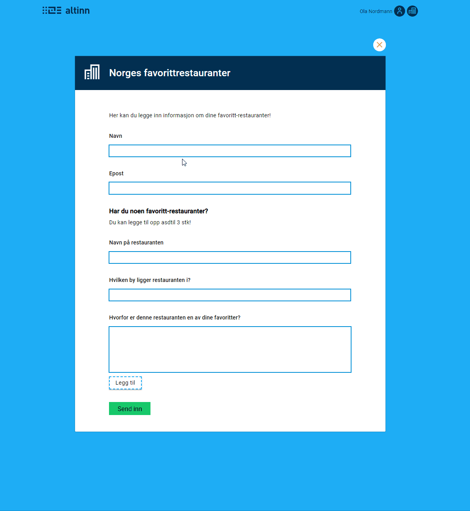

{}
Støtte for gruppering av felter er på plass i appene, men ikke i Altinn Studio. Oppsettet må gjøres manuelt inntil videre. Dokumentasjonen
oppdateres når støtte for oppsett er på plass i Altinn Studio.
{}

## Oppsett
Felter i skjema kan settes opp til å bli del av en _gruppe_. Dette kan brukes til å f.eks. sette opp dynamikk på en enkelt gruppe av felter,
i stedet for på hvert enkelt felt. I tillegg må felter kunnne grupperes for å støtte [repeterende grupper](#repeterende-grupper) i skjema.

En gruppe settes opp i `FormLayout.json`, sammen med de andre komponentene i skjemaet. Noen punkter å notere seg:

- Gruppen må ligge _før_ ev. komponenter som skal inngå i gruppen i FormLayout.json.
- En gruppe _MÅ_ ha `type: "group"` satt for at den skal registreres som en gruppe

Eksempel på en (repeterende) gruppe definert i `FormLayout.json` som inneholder 4 felter som kan repetere 3 ganger:
En gruppe defineres på følgende måte i FormLayout.json:

```json
{
  "id": "<unik-id>",
  "type": "group",
  "dataModelBindings": {
    "group": "<gruppen i datamodellen (kun repeterende grupper)>"
  },
  "maxCount": <Antall ganger gruppen kan repetere>,
  "children": [
    "<felt-id>",
    "<felt-id>",
    ...
  ]
}
```

| Parameter         | Påkrevd | Beskrivelse                                                                                                                               |
| ----------------- | ------- | ----------------------------------------------------------------------------------------------------------------------------------------- |
| id                | Ja      | Unik ID, tilsvarer ID på andre komponenter. Må være unik i FormLayout.json-filen.                                                         |
| type              | Ja      | MÅ være "group". Sier at dette er en gruppe.                                                                                              |
| dataModelBindings | Nei     | MÅ være satt for repeterende grupper, med `group`-parameteren som i eksempelet over. Skal peke på den repeterende gruppen i datamodellen. |
| maxCount          | Ja      | Antall ganger en gruppe kan repetere. Settes til `1` om gruppen ikke er repeterende.                                                      |
| children          | Ja      | Liste over de feltene som skal inngå i gruppen. Her brukes felt-id fra FormLayout.json                                                    |


## Repeterende grupper

Grupper i datamodellen inneholder ett eller flere felter. Grupper er definert som _repeterende_ dersom de har `maxOccurs > 1` i xsd'en. 
En gruppe som er repeterende i datamodellen må også settes opp som repeterende i skjemaet, ellers vil lagring av data feile.  


## Eksempel 

Skjema med noen enkelt-felt, og en repeterende gruppe som:

- inneholder 3 felter
- kan repeteres opp til 3 ganger



Oppsett i `FormLayout.json` fra eksempelet over:

```json
{
  "data": {
    "layout": [
      {
        "id": "info-intro",
        "type": "Paragraph",
        "componentType": 1,
        "textResourceBindings": {
          "title": "info.intro"
        },
        "dataModelBindings": {}
      },
      {
        "id": "person-name",
        "type": "Input",
        "componentType": 2,
        "textResourceBindings": {
          "title": "person.name"
        },
        "dataModelBindings": {
          "simpleBinding": "person.name"
        },
        "required": true,
        "readOnly": false
      },
      {
        "id": "person-email",
        "type": "Input",
        "componentType": 2,
        "textResourceBindings": {
          "title": "person.email"
        },
        "dataModelBindings": {
          "simpleBinding": "person.email"
        },
        "required": true,
        "readOnly": false
      },
      {
        "id": "restaurant-about",
        "type": "Paragraph",
        "componentType": 1,
        "textResourceBindings": {
          "title": "restaurant.about"
        },
        "dataModelBindings": {}
      },
      {
        "id": "restaurants-group",
        "type": "group",
        "dataModelBindings": {
          "group": "restaurants"
        },
        "maxCount": 3,
        "children": [
          "restaurant-name",
          "restaurant-city",
          "restaurant-reason"
        ]
      },
      {
        "id": "restaurant-name",
        "type": "Input",
        "componentType": 2,
        "textResourceBindings": {
          "title": "restaurant.name"
        },
        "dataModelBindings": {
          "simpleBinding": "restaurants.name"
        },
        "required": true,
        "readOnly": false
      },
      {
        "id": "restaurant-city",
        "type": "Input",
        "componentType": 2,
        "textResourceBindings": {
          "title": "restaurant.city"
        },
        "dataModelBindings": {
          "simpleBinding": "restaurants.city"
        },
        "required": true,
        "readOnly": false
      },
      {
        "id": "restaurant-reason",
        "type": "TextArea",
        "componentType": 3,
        "textResourceBindings": {
          "title": "restaurant.reason"
        },
        "dataModelBindings": {
          "simpleBinding": "restaurants.reason"
        },
        "required": true,
        "readOnly": false
      },
      {
        "id": "submit-button",
        "type": "Button",
        "componentType": 9,
        "textResourceBindings": {
          "title": "Send inn"
        },
        "dataModelBindings": {},
        "textResourceId": "Standard.Button.Button",
        "customType": "Standard"
      }
    ]
  }
}
```
