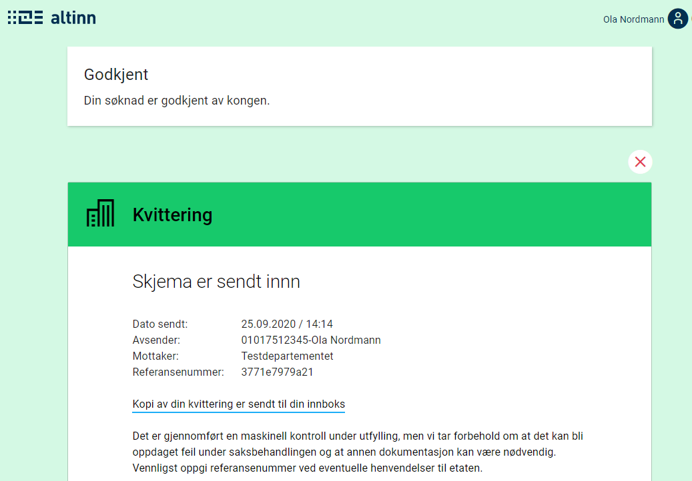

Denne siden er foreløpig ikke fullstendig, mer informasjon vil komme på et senere tidspunkt.

En instansiert applikasjon vil ha et tilhørende instans-objekt. Dette objektet inneholder metadata om den spesifikke instansen.
Om du ønsker å lære mer om instans og api'et rundt så kan du lese teknisk dokumentasjon om dette [her.](https://docs.altinn.studio/teknologi/altinnstudio/altinn-api/#query-instances).  

## Substatus

Som app-eier kan man sette en substatus på instansen, dette for å kunne gi sluttbruker ytterligere informasjon om hvilken tilstand instansen befinner seg i.
Substatus vil vises frem både i meldingsboksen i Altinn og på kvitteringssiden.

Substatusen er et objekt som kan settes på instansobjektet. Hvordan dette gjøres står beskrevet [her.](https://docs.altinn.studio/teknologi/altinnstudio/altinn-api/#instance-substatus).
Substatus er et enkelt objekt som inneholder `label` og `description`. Disse feltene kan enten inneholde ren tekst, eller en tekstnøkkel som referer til applikasjonstekstene. Verdt å merke seg at vi ikke støtter variabler i tekst for disse tekstene.
I meldingsboksen er det satt en begrensning på 25 tegn på `label`, og inneholder label mer enn 25 tegn vil bare de 22 første tegnene bli brukt og "..." lagt til på slutten.

Eksempel på et substatus-objekt:
```json
{
    "label": "some.label",
    "description": "Beskrivelse i klarteskst"
}
```

Under ser du du eksempler på hvordan substatus ser ut i meldingsboksen og i kvitteringen hvor substatusen er satt opp på følgende måte:
```json
{
    "label": "Godkjent",
    "description": "Din søknad er godkjent av kongen."
}
```





