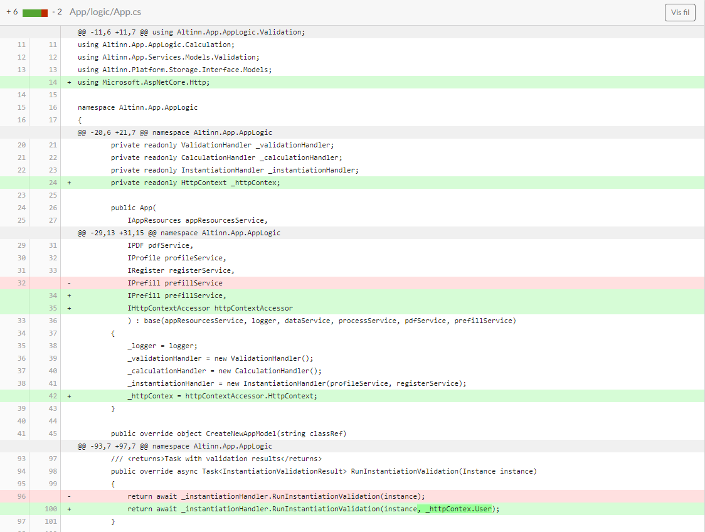
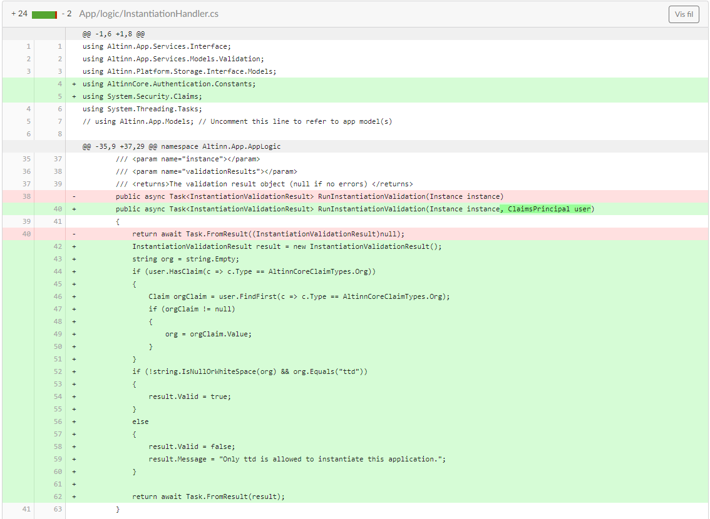
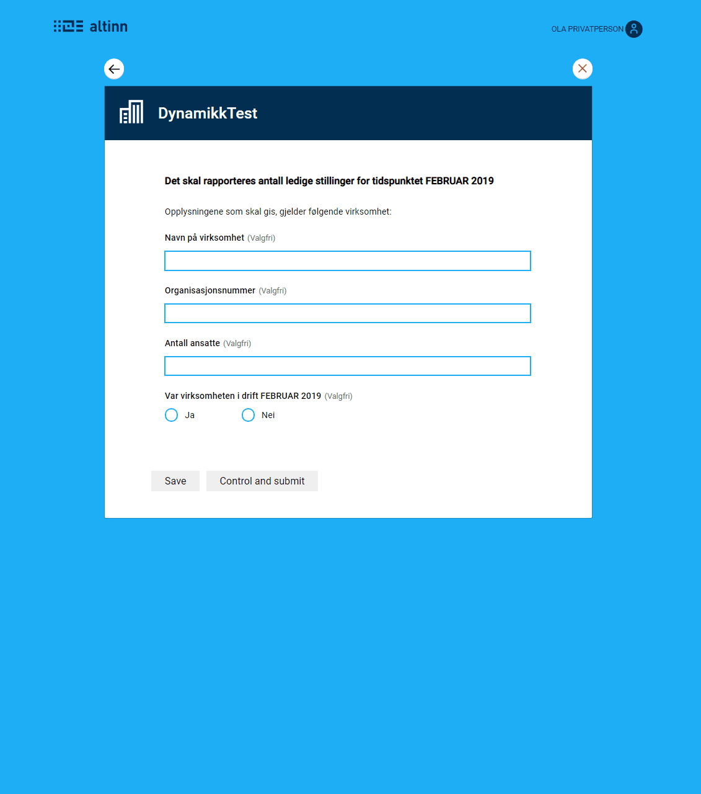
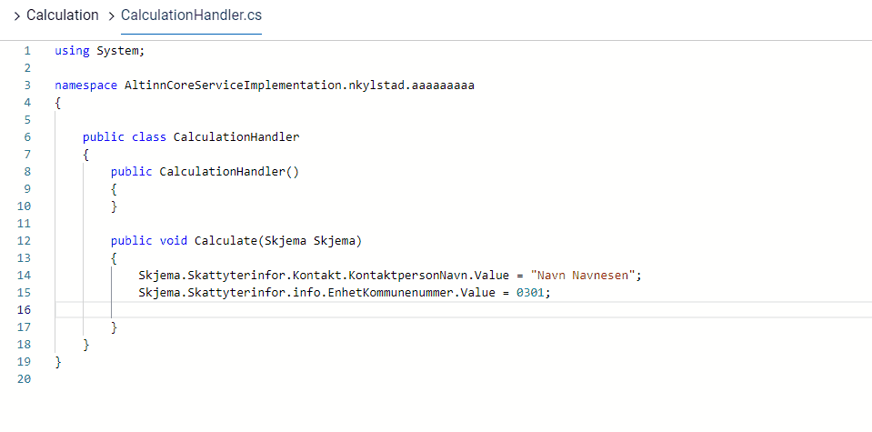

De forskjellige filene som brukes til å definere logikk, finner man i logikk-menyen,
som er tilgjengelig i UI-editoren via  _f(x)_-ikonet øverst til høyre.


De kan også redigeres direkte fra applikasjonsrepoet, under folderen `App/logic` (for serverside applikasjonslogikk) eller folderen `App/ui` (for dynamikk).
Denne folderen inneholder som standard følgende filer:

```C#
🗀 App/
  🗀 logic/
    🗀 Calculation/
      🗎 CalculationHandler.cs
    🗀 Validation/
      🗎 ValidationHandler.cs
    🗎 App.cs
    🗎 InstantiationHandler.cs
```
Flere filer kan legges til her når det er nødvendig.

Et komplett prosjekt med eksempler på serverside applikasjonslogikk ligger [her](https://dev.altinn.studio/repos/ttd/webdemo2).

{}
**MERK:** Måten man refererer til elementer i datamodellen er ulik mellom OR og SERES typer XSDer.
For OR XSDer er `.value` et nødvendig suffiks i referansen. Eksempelkoden under bruker en blanding av de to typene datamodeller.
{}

## Instansiering
Applikasjonslogikk knyttet til instansiering kan defineres i `InstantiationHandler.cs`. For en helt ny app vil det være to funksjoner implementert i denne klassen:

 - `RunInstantiationValidation` - lag egne sjekker for å avgjøre om en bruker/avgiver får lov til å instansiere.
 - `DataCreation` - lag tilpasset prefill data.

### Egendefinerte valideringsregler for instansiering
Som tidligere nevnt, kan sjekker for instansieres kan defineres i `RunInstantiationValidation`.
Tilgang til _Register_- og _Profile_-tjenester er inkludert i `InstantiationHandler.cs`-filen, som tillater å gjøre sjekker mot disse.
Valideringsregler for instansiering kan innebære å validere tidspunkt til spesifikke brukerrestriksjoner og komplekse sjekker som krever eksterne API-kall.


#### Eksempel 1 - Insansiering kun tillatt før kl 15:00 på en gitt dag

```C# {hl_lines=[4]}
public async Task<InstantiationValidationResult> RunInstantiationValidation(Instance instance)
{
    DateTime now = DateTime.Now;
    if (now.Hour < 15)
    {
        return new InstantiationValidationResult()
        {
            Valid = false,
            Message = "ERROR: Instantiation not possible before 3PM."
        };
    }

    return null;
}
```

#### Eksempel 2 - Instansiering kun tillatt for applikasjonseier

Kodebasen som eksempelet er basert på er tilgjengelig [her](https://altinn.studio/repos/ttd/example-app-1).
(krever innlogging i altinn.studio)

For å kunne begrense instansiering til en gitt entitet, i dette tilfellet applikasjonseier,
er det to filer som må endres: `App.cs` og `InstantiationHandler.cs`. 



I `App.cs` tilgjengeliggjøres http-konteksten og 
brukerdata (claims principals) hentes ut fra konteksten ved å kalle ```_httpContext.User```.

For å validere instansieringen kan man sjekke ett av to claims i konteksten.
Enten organisasjonsen trebokstavsforkortelse eller organisasjonsnummeret.
Valideringen skjer i `InstantiationHandler.cs` og eksempelet nedenfor bruker organisasjonsforkortelsen. 

For å validere basert på organisasjonsnummer kan du følge eksempelet nedenfor,
og bytte ut *AltinnCoreClaimTypes&#46;Org* med *AltinnCoreClaimTypes.OrgNumber*.  
om må gjøres i denne file ser du nedenfor.




```C#
public async Task<InstantiationValidationResult> RunInstantiationValidation(Instance instance, ClaimsPrincipal user)
{
    var result = new InstantiationValidationResult();
    string org = string.Empty;

    if (user.HasClaim(c => c.Type == AltinnCoreClaimTypes.Org))
    {
        Claim orgClaim =
          user.FindFirst(c => c.Type == AltinnCoreClaimTypes.Org);
          
        if (orgClaim != null)
        {
            org = orgClaim.Value;
        }
    }

    if (!string.IsNullOrWhiteSpace(org) && org.Equals("ttd"))
    {
        result.Valid = true;
    }
    else
    {
        result.Valid = false;
        result.Message =
          "Only ttd is allowed to instantiate this application.";
    }

    return await Task.FromResult(result);
}
```

### Egendefinert prefill
Dette er logikk som kan brukes til å preutfylle all mulig data, inkludert data fra `Register` og `Profile`. Man kan også f.eks. gjøre eksterne API-kall for å hente data.

Under er et eksempel der feltet `Person.FirstName` preutfylles med verdien `Test Testesen`:

```C#
public async Task DataCreation(Instance instance, object data)
{
    if (data.getType() == typeof(Skjema))
    {
      Skjema model = (Skjema)data;
      model.Person.FirstName = "Test Testesen";
    }
}
```

## Validering

Valideringer sørger for at brukerens input er gyldig med tanke på datamodellen,
i tillegg til alle egendefinerte regler som settes opp for applikasjonen.
Valideringer kan kjøres enten på klient (dvs. browseren) eller serversiden.

### Klientside-validering

{}
MERK: Konfigurasjon av klientside-validering er foreløpig ikke tilgjenglig.
Dokumentasjonen vil oppdateres når ny funksjonalitet blir tilgjengelig.
{}

Disse valideringene kjøres automatisk og,
validerer brukerens input opp mot restriksjoner i datamodellen.
Følgende restriksjoner er tilgjengelige for øyeblikket:

- min verdi (tall)
- max verdi (tall)
- min lengde
- max lengde
- lengde
- mønster / patterns

I tillegg støttes påkrevde felt.
Dette kobles automatisk til datamodellen og ingen ytterligere konfigurasjon er nødvendig.

### Serverside-validering

Serverside-validering kan deles opp i to kategorier:

- **Valideringer mot datamodell** - Disse kjører automatisk når brukeren prøver å sende inn skjemadata.
- **Egendefinerte valideringer** - Disse skrives av applikasjonsutvikleren,
og kjører når brukeren prøver å sende inn skjemadata eller flytte prosessen til et nytt steg.

### Hvordan legge til egendefinert validering
Egendefinerte validering kan igjen deles opp i to kategorier; task-validering og data-validering.
  - Task-validering vil kjøres hver gang validering trigges enten manuelt fra applikasjonen eller når man prøver å flytte seg framover i prosessen.
  - Data-validering vil kjøre dersom man står på et steg som har definerte dataelementer knyttet til seg.

Valideringer er skrevet i C#, i `ValidationHandler.cs` -filen i applikasjonsmalen.
Filen kan aksesseres og endres i Altinn Studio via logikkmenyen, ved å velge _Rediger valideringer_,
eller direkte i applikasjonsrepoet der ligger filen i `logic/Validation`-mappen.

Endringer gjøres i `ValidateData` og `ValidateTask`-metodene (disse er tomme når appen lages).
Førstnevnte får inn et dataobjekt og sistnevnte får inn instansen og taskId.
For å legge til en valideringsfeil brukes `AddModelError`-metoden til `validationResults` object som sendes med i begge metodene.

Et eksempel på en enkel data-validering som sjekker at feltet _FirstName_ ikke inneholder verdien _1337_, når rotelementet til modellen er `Skjema` er vist nedenfor:

```C# {hl_lines=[12]}
public void ValidateData(object data, ModelStateDictionary validationResults)
{
    if (data.GetType() == typeof(Skjema))
    {
      // Cast instance data to model type
      Skjema model = (Skjema)data;

      // Get value to test - FirstName
      string firstName = Skjema?.Person?.FirstName;

      // Check if FirstName exists, and contains the value "1337"
      if (firstName != null && firstName.Contains("1337"))
      {
        // Add validation error, with error message and list
        // of affected fields (in this case Person.FirstName)
        validationResults.AddModelError(
          "Person.FirstName",
          "Error: First name cannot contain the value '1337'."
        );
      }
    }
}
```

Se kommentarer i koden over for en forklaring på hva de ulike delene gjør.

Et eksempel på en enkel task-validering som sjekker hvor lang tid brukeren har brukt på Task_1 og returnerer en feil dersom det har tatt lenger enn 3 dager.

```C# {hl_lines=["5-6"]}
public async Task ValidateTask(Instance instance, string taskId, ModelStateDictionary validationResults)
{
  if (taskId.Equals("Task_1"))
  {
    DateTime deadline = ((DateTime)instance.Created).AddDays(3);
    if (DateTime.UtcNow < deadline)
    {
      validationResults.AddModelError("Task_1", $"Ferdigstilling av Task_1 har tatt for lang tid. Vennligst start på nytt.");
    }
  }
}
```

### Enkeltfeltvalidering

Dersom det er behov for umiddelbar validering av et felt
som ikke kan dekkes i klientsidevalideringen, 
så kan man sette opp en trigger for validering på enkeltfelter i `formLayout.json`

```json {hl_lines=[13]}
{
  "data": {
    "layout": [
      {
        "id": "3611fb2a-c06b-4fa7-a400-3f6c1ece64e1",
        "textResourceBindings": {
          "title": "25795.OppgavegiverNavnPreutfyltdatadef25795.Label"
        },
        "dataModelBindings": {
          "simpleBinding": "etatid"
        },
        "type": "Input",
        "triggers": ["validation"] , // <--- Add this field
      },
      {
        "id": "9ec368da-d6a9-4fbd-94d0-b4dfa8891981",
        "type": "Button",
        "textResourceBindings": {
          "title": "Button"
        },
        "dataModelBindings": {},
        "textResourceId": "Standard.Button.Button",
        "customType": "Standard"
      }
    ]
  }
}
```

Konfigurasjonen overfor vil resultere i at din egendefinerte validering i `ValidationHandler.cs`
vil trigges hver gang feltet oppdaterer seg. Dersom du har behov for å vite hvilket
felt som trigget valideringen er denne tilgjengelig i http-konteksten som en header på requesten ved navn _ValidationTriggerField_.

Et eksempel på en egendefinert validering der headerverdien hentes ut er vist nedenfor.

```csharp
 public async Task ValidateData(object data, ModelStateDictionary validationResults)
 {
    _httpContextAccessor.HttpContext.Request.Headers.TryGetValue("ValidationTriggerField", out StringValues value);

    if (value.Count > 0 && value[0].Equals("kommune"))
    {
      // Cast instance data to model type
      flyttemelding model = (flyttemelding)data;

      // Get value to test - Kommune
      string kommune = model.kommune;

      if (!kommune.Equals("Oslo"))
      {
          validationResults.AddModelError(value[0], "Dette er ikke en gyldig kommune.");
      }
    }

    await Task.CompletedTask;
 }
```

**OBS** Merk at validering av enkeltfelter bør implementeres slik at det kjører både på trigger og under generell validering.
Eksempelet som omhandler flere komplekse valideringer viser hvordan dette kan implementeres.

Det er gjort flere ting for å få denne kodesnutten til å kjøre

1. I _ValidationHandler.cs_ inkluderes `using Microsoft.Extensions.Privites;` øverst i filen for å kunne ta i bruk `StringValues`. 
2. I _App.cs_ inkluderes `using Microsoft.AspNetCore.Http;` øverst i filen for å kunne ta i bruk `IHttpContextAccessor`.
3. I _App.cs_ dependency injectes `IHttpContextAccessor` i konstruktøren og sendes med videre til ValidationHandler.

```cs {hl_lines=[10, 14]}
public App(
            IAppResources appResourcesService,
            ILogger<App> logger,
            IData dataService,
            IProcess processService,
            IPDF pdfService,
            IProfile profileService,
            IRegister registerService,
            IPrefill prefillService,
            IHttpContextAccessor httpContextAccessor // <--- Add this line
            ) : base(appResourcesService, logger, dataService, processService, pdfService, prefillService)
        {
            _logger = logger;
            _validationHandler = new ValidationHandler(httpContextAccessor);  // <--- Include the new property here
            _calculationHandler = new CalculationHandler();
            _instantiationHandler = new InstantiationHandler(profileService, registerService);
        }
```

Dersom man har flere komplekse valideringer som er tidkrevende er det anbefalt å implementere flere private metoder
for validering av disse og bruke ValidationTriggerField til å avgjøre hvilken private metode som skal kjøres.
Man kan bl.a. bruke en _switch statement_ for å oppnå dette.

```cs
public async Task ValidateData(object data, ModelStateDictionary validationResults)
{
    if (data.GetType() == typeof(flyttemelding))
    {
        flyttemelding model = (flyttemelding)data;

        _httpContextAccessor.HttpContext.Request.Headers.TryGetValue("ValidationTriggerField", out StringValues value);

        string dataField = value.Any() ? value[0] : string.Empty;

        switch (dataField)
        {
            case "kommune":
                ValidateKommune(model, validationResults);
                break;
            case "boaddresse":
                ValidateBoAdresse(model, validationResults);
                break;
            default:
                ValidateKommune(model, validationResults);
                ValidateBoAdresse(model, validationResults);
                break;
        }
    }
}

private void ValidateKommune(flyttemelding model, ModelStateDictionary validationResults)
{
    if (model.kommune != null && !model.kommune.Equals("Oslo"))
    {
        validationResults.AddModelError(nameof(model.kommune), "Dette er ikke en gyldig kommune.");
    }
}
private void ValidateBoAdresse(flyttemelding model, ModelStateDictionary validationResults)
{
    if (model.boaddresse != null && model.boaddresse.Length > 150)
    {
        validationResults.AddModelError(nameof(model.boaddresse), "Boadresse kan ikke være lengere enn 150 tegn.");
    }
}
```

### Myk validering

{}
Denne funksjonaliteten er under utvikling, og er p.t. ikke tilgjengelig.
{}

Myke valideringer (eller advarsler) er valideringsmeldinger som ikke stopper bruker fra å sende inn eller gå videre til neste steg i prosessen.
Denne typen valideringer kan f.eks. brukes til å be brukeren om å verifisere input som virker feil eller rart, men som strengt tatt ikke er ugyldig.
Myke valideringer legges til fra server-siden i validerings-logikken, på samme måte som vanlige validerings-feil. Forskjellen er at valideringsmeldingen
må prefixes med `*WARNING*`. Dette vil da tolkes som en myk validering. Prefixen `*WARNING*` blir ikke synlig for sluttbruker.


<!-- An example is shown below:

```csharp
public void Validate(TestModel TestModel, RequestContext requestContext, ModelStateDictionary modelState)
{   
    // Validate first name
    ValidateFirstName(TestModel, modelState);
}

private void ValidateFirstName(TestModel TestModel, ModelStateDictionary modelState)
{
    // First, make sure that the field exists
    string firstName = TestModel?.Person?.FirstName;

    // Check if field contains "1337"
    if (firstName != null && firstName.Contains("1337")) 
    {
        // If the field value contains "1337", add an error message using AddModelError-method.
        // The first argument is the error message key, which should be the data model path (without root node), if possible.
        // The second argument is the error message, which can be either a text, or a text key.
        // When adding a soft validation, prefix the error message with *WARNING*
        modelState.AddModelError("Person.FirstName", "*WARNING*Are you sure your first name contains 1337?");
    }
}
```-->

## Kalkulering  
Kalkuleringer kjøres på serveren, og er basert på input fra sluttbruker/skjemadata.
Kalkuleringer trenger ikke å være rent matematiske, det kan også være å overføre verdier mellom felter, resultater av API-kall, osv. 

Kalkuleringer kodes i C#, i filen `CalculationHandler.cs`. Denne filen kan redigeres enklest ved å laste ned kildekoden til app'en og redigere på egen maskin, f.eks. i Visual Studio Code.
Datamodellen med skjemadata er tilgjengelig og kan redigeres/oppdateres etter ønske/behov.

Kalkuleringer kjøres hver gang data lagres. Med auto-lagring på (dette er standard) vil kalkulering kjøres hver gang en bruker har gjort en endring og hopper ut av et felt.

{}
VIKTIG: Når en kalkulering er kjørt som har oppdatert dataene på server, må front-end få beskjed om dette, sånn at de oppdaterte dataene kan lastes inn.
For å gjøre dette, må `Calculate`-metoden returnere `true` om det er noen av dataene som har blitt oppdatert.
Hvis dette ikke gjøres, vil de oppdaterte dataen ikke være synlig for sluttbruker før de ev. laster inn siden på nytt.
{}

Eksempel på kode som erstatter en gitt verdi (`12345678`) med en annen verdi (`22222222`) i et gitt felt vises under:

```C# {hl_lines=[16,22]}
public bool Calculate(object data)
{
    if (data.GetType() == typeof(Skjema))
    {
        // Cast the data object to model type to access all fields
        Skjema model = (Skjema)data;

        // Get the existing value of a specified field, if it exists
        string tlf = 
            model?
            .OpplysningerOmArbeidstakerengrp8819?
            .OpplysningerOmArbeidstakerengrp8855?
            .OppgavegiverTelefonnummerdatadef27335?.value;

        // Check if the value exists and is equal to "12345678"
        if (tlf != null && tlf == "12345678")
        {
            // Replace the value in the field with a new value, "22222222"
            model
              .OpplysningerOmArbeidstakerengrp8819
              .OpplysningerOmArbeidstakerengrp8855
              .OppgavegiverTelefonnummerdatadef27335.value = "22222222";

            // Return true to trigger a re-loading of data 
            return true;
        }
    }

    // Return false if no changes have been made
    return false;
}
```


## Dynamikk
Dynamikk er hendelser som skjer på klient-siden. Disse kan deles opp i to kategorier:
- Beregning - kjøre beregninger på klient-side, og oppdatere felter med ny verdi
- Vis/skjul felter - bestemme om felter skal vises eller skjules basert på verdier i skjema.

All dynamikk skrives som funksjoner i javascript, i filen  `RuleHandler.js`. Denne filen finner man under `App/ui`-mappen i appen, og kan også redigeres direkte i `Lage`-
visningen i Altinn Studio, ved å velge _Rediger dynamikk_ i høyre-menyen. Funksjonene som er definert i denne filen kan da configurere til å kjøres for feltene i skjemaet.

{}
Koden som definerer beregninger eller regler for vis/skjul bør settes opp sånn at den håndterer ev. feil i input. F.eks. bør de takle
å motta tom input, eller å motta en tekst selv om de forventer et tall, uten å kræsje. Om dynamikken ikke fungerer som forventet, ta en titt på koden som definerer
beregninger eller regler for vis/skjul for å se om det er noe feilhåndtering som mangler.
{}

### Legg til/rediger funksjoner for beregninger eller vis/skjul

I filen `RuleHandler.js` er det satt opp 2 javascript-objekter:

- `ruleHandlerObject` - funksjoner for beregninger
- `conditionalRuleHandlerObject` - funksjoner med regler for vis/skjul

Det er inne i disse at de forskjellige funksjonene skal defineres. I tillegg er det satt opp to _hjelpe-objekter_  (`ruleHandlerHelper` og `conditionalRuleHandlerHelper`), hvor man skal sette opp hva slags input de forskjellige funksjonene forventer å få inn. Dette gjør det mulig å konfigurere opp reglene i Altinn Studio senere. For at en funksjon skal være tilgjengelig for å konfigureres som dynamikk, må selve funksjonen være definert i hoved-objektet 
(`ruleHandlerObject` eller `conditionalRuleHandlerObject`), og parametrene den forventer å få inn må være satt opp i det tilhørende hjelpe-objektet.

Strukturen på hjelpe-objektet vises under:

```javascript
var ruleHandlerHelper = {
  <name_of_rule>: () => {
    return {
      <input_param>: "<description>",
      <input_param>: "<description>",
      <input_param>: "<description>"
      ...
    };
  }
}
```

Strukturen på hoved-objektet, som inneholder funksjoner som brukes i dynamikk, vises under:

```javascript
var ruleHandlerObject = {
  <name_of_rule>: (<input_variable_name>) => {
    // Do something here
    // Values from input parameters defined in 
    // helper can be accessed through the object passed
    // into the rule, f.ex.
    // <input_variable_name>.<input_param>
  }
}
```

For eksempel, for å lage en regel som returnerer summen av to tall (beregning), vil man trenge følgende kode:

```javascript
var ruleHandlerHelper = {
  sum: () => {
    return {
      field1: "Field 1 in sum",
      field2: "Field 2 in sum"
    };
  }
}

var ruleHandlerObject = {
  sum: (data) => {
    // Check if data is available
    if (!data) return;

    // Check if value from input fields are available
    // If not, use value 0 in sum
    data.field1 = data.field1 ? data.field1 : 0;
    data.field2 = data.field2 ? data.field2 : 0;

    // return the sum
    return data.field1 + data.field2;
  }
}
```

Noen standard-metoder for beregniner, med hjelpe-objekt, er satt opp automatisk når app'en lages i Altinn Studio. Noen av disse er vist i eksempelet under.

| Method name          | Description                                                      | Parameters              | Defined in object/helper                                      |
| -------------------- | ---------------------------------------------------------------- | ----------------------- | ------------------------------------------------------------- |
| `sum`                | Returnerer summen av 2 verdier                        | `value1`, `value2`      | `ruleHandlerObject`/`ruleHandlerHelper`                       |
| `fullName`           | Returnerer to tekster (fornavn og etternavn) satt sammen med mellomrom mellom. | `firstName`, `lastName` | `ruleHandlerObject`/`ruleHandlerHelper`                       |
| `lengthGreaterThan4` | Returnerer `true` dersom verdien den får inn er lengre enn 4 karakterer lang.  | `value`                 | `conditionalRuleHandlerObject`/`conditionalRuleHandlerHelper` |


Regler for dynamikk kjøres dersom det har skjedd en endring i input-parametrene til de forskjellige reglene. 
Funksjonene som da kjøres må kunne håndtere dersom det f.eks. har kommet inn kun 1 av 2 parametre eller lignende.

Et eksempel på hvordan dette kan gjøres er vist i `sum`-funksjonen under, hvor man tester hvilke parametre man 
har fått inn, og setter verdi til `0` på den/de parametre som mangler, sånn at regelen fortsatt fungerer.

```javascript
var ruleHandlerObject = {
  sum: (obj) => {
    obj.value1 = obj.value1 ? +obj.value1 : 0;
    obj.value2 = obj.value2 ? +obj.value2 : 0;
    return obj.value1 + obj.value2;
  },

  fullName: (obj) => {
    return obj.firstName + ' ' + obj.lastName;
  }
}
var ruleHandlerHelper = {
  sum: () => {
    return {
      value1: "Value 1",
      value2: "Value 2"
    }
  },

  fullName: () => {
    return {
      firstName: "First name",
      lastName: "Last name"
    };
  }
}

var conditionalRuleHandlerObject = {
  lengthBiggerThan4: (obj) => {
    if (obj.value == null) return false;
    return obj.value.length >= 4;
  }
}
var conditionalRuleHandlerHelper = {
  lengthBiggerThan4: () => {
    return {
      value: "value"
    }
  }
}
```

### Konfigurere dynamikk for skjema-komponenter

1. Legg til de skjema-komponentene som ønskes i layout.
2. I høyre-menyen, velg å legge til _Regler for beregninger_ eller _Regler for vis/skjul felt_.
3. Velg en tilgjengelig funksjon som gjør det du ønsker. Legg evt. til en ny funksjon, se beskrivelse over.
4. Sett opp hvilke(t) felt som skal fungere som _input_ til funksjonen - her er det felt i datamodellen som gjelder.
5. Sett opp hvilke(t) fom skal påvirkes av regelen (skal motta beregnet verdi, eller skal vises/skjules) - her er det skjemakomponent som gjelder.
  - For regler for vis/skjul felt kan man velge flere felter som skal vises/skjules basert på samme regel.
6. Lagre konfigurasjonen.
7. Test at det fungerer som forventet.

Eksisterende oppsett ligger synlig i høyre-menyen og kan redigeres/slettes.

Konfigurasjonen legges i filen `App/ui/RuleConfiguration.json`. Denne kan også redigeres manuelt ved behov.

### Eksempel på bruk av dynamikk i skjema

Scenario:

En app med skjema som har flere felter for input. En av disse er en radioknapp-gruppe, med valgene "Ja" og "Nei".
Avhengig av hva sluttbruker velger her, skal forskjellig innhold vises i skjemaet:

- Ja: Et nytt input-felt vises, sammen med ekstra informasjon om hvordan feltet skal fylles ut.
- Nei: En annen informasjons-tekst vises.

Dette kan gjøres ved å legge inn følgende i `RuleHandler.js`, enten via _Rediger dynamikk_ i Altinn Studio, eller ved å laste ned kildekoden
til appen og redigere lokalt.

```javascript
var conditionalRuleHandlerObject = {
  sjekkVirksomhetIDrift: (obj) => {
    return (obj.value && obj.value === "Ja");
  },

  sjekkVirksomhetIkkeIDrift: (obj) => {
    return (!obj.value || obj.value != "Ja");
  }
}

var conditionalRuleHandlerHelper = {
  sjekkVirksomhetIDrift: () => {
    return {
      value: "Verdi"
    }
  },
  sjekkVirksomhetIkkeIDrift: () => {
    return {
      value: "Verdi"
    }
  }
}
```

Her har to funksjoner blitt opprettet, som sjekker om verdien er henholdsvis "Ja" eller ikke.
Etter at denne koden er lagt til, kan regelen konfigureres i Altinn Studio. Resultatet vises under. 



### Dynamikk i repeterende gruppe
Det er også mulig å sette opp dynamikk innad i en repeterende gruppe. Dette krever at man først setter opp regelen som
vanlig, og så redigerer på oppsettet `App/ui/RuleConfiguration.json` manuelt. Helt konkret, er det følgende som må endres:

- For alle `inputParams`, må man legge til `{0}` etter _gruppe-delen_ av data-modellen. F.eks. `Datamodell.gruppe{0}.felt`. Dette erstattes i koden av _indeksen_ til 
hvert enkelt innslag av den repeterende gruppen.
- For alle `selectedFields` (altså feltene som påvirkes av reglen), må man legge til `{0}` bak felt-id'en. F.eks. `skjemaFelt1{0}`
- I tillegg må man legge enn en ny egenskap på regelen, `repeatingGroups`. Denne skal inneholde id'en til gruppen i layout-filen.

Et eksempel på en regel som er satt opp for repeterende grupper vises under:

```json {hl_lines=[8,12-13,15-17]}
{
  "data": {
    "ruleConnection": {},
    "conditionalRendering": {
      "9f9f2a50-360b-11ea-b69a-8510e2e248b9": {
        "selectedFunction": "lengthBiggerThan4",
        "inputParams": {
          "value": "Skjemainnhold.personalia.arbeidserfaring{0}.stilling"
        },
        "selectedAction": "Show",
        "selectedFields": {
          "962e2f60-3797-11ea-bfa5-9922024b4738": "a-e-4{0}",
          "something": "arbeidsgiver-adresse{0}"
        },
        "repeatingGroup": {
          "groupId": "arbeidserfaring-group",
        }
      }
    }
  }
}
```

### Eksempel med mer kompleks dynamikk
Example with more complex dynamics

Scenario:
Et skjema med to sett med radioknapper (ja/nei) og en avkrysningsboks.

- Når skjema lastes, er kun det første settet med radioknapper synlig. 
- Hvis brukeren velder _Ja_, vises det andre settet med radioknapper. 
  - Hvis brukeren velger _Ja_ i det andre settet, blir avkrysningsboksen synlig.
  - Hvis brukeren går tilbake til det første settet med radioknapper og velger nei, blir både det andre settet med radioknapper og avkrysningsboksen ikke lenger synlig.


#### Alternativ 1
Dette kan settes opp ved å lage 2 forskjellige betingelser for når feltene skal vises:

- En betingelse for det andre settet med radioknapper
  - Vises dersom _Ja_ er valgt i det første settet
- En betingelse for avkrysningsboksen
  - Vises når _Ja_ er valgt i begge sett med radioknapper.

Koden for å løse dette kan være:

```javascript
var conditionalRuleHandlerObject = {
  showField2: (obj) => {
    if (obj && obj.field1 && obj.field1=== "yes") {
      return true;
    }
    return false;
  },

  showField3: (obj) => {
    if (obj && obj.field1 && obj.field1 === "yes"
      && obj.field2 && obj.field2 === "yes") {
        return true;
    }
    return false;
  }
}

var conditionalRuleHandlerHelper = {
  showField2: () => {
    return {
      field1: "Field 1"
    };
  },

  showField3: () => {
    return {
      field1: "Field 1",
      field2: "Field 2"
    };
  }
}
```

#### Alternativ 2
Dette kan også settes opp ved å bruke den samme betingelsen for å vise både det andre settet med radionkapper og avkrusningsboksen. I tillegg må man 
da ha en regel som sletter verdien i det andre settet med radioknapper dersom verdien i det første settet settes til _Nei_:

```javascript
var ruleHandlerObject = {
  clearField: (obj) => {
    if (obj && obj.checkValue === "no") {
      return "";
    }
    return obj.currentValue;
  }
}

var ruleHandlerHelper = {
  clearField: () =>  {
    return {
      checkValue: "check against this value",
      currentValue: "the current value"
    }
  }
}

var conditionalRuleHandlerObject = {
  showField: (obj) => {
    if (obj && obj.checkField && obj.checkField === "yes") {
      return true;
    }
    return false;
  }
}

var conditionalRuleHandlerHelper = {
  showField: () => {
    return {
      checkField: "check against this value"
    };
  }
}
```

## Auto-complete/intellisense

Ved å redigere kildekoden i appene lokalt, i f.eks. Visual Studio Code, får man intellisense og autocomplete med på kjøpet. 
For C#-filene er det enkleste å jobbe med disse lokalt.

For javascript-filene er det også intellisense/autocomplete tilgjengelig om man ønsker å redigere filene direkte i Altinn Studio.
Dette kommer automatisk mens man skriver, og man kan også tvinge det frem ved å trykke `CTRL + SPACE`


