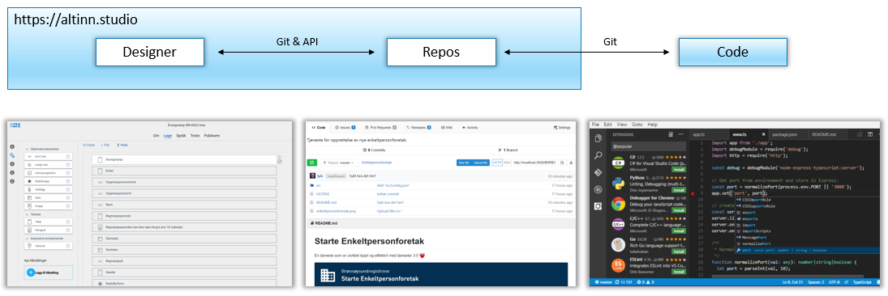
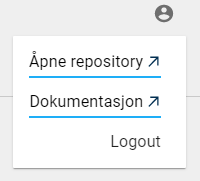
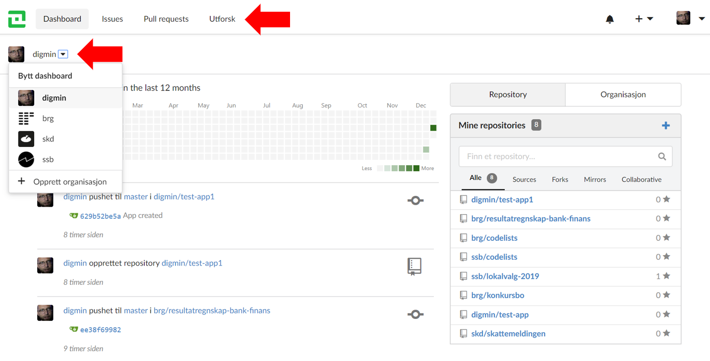
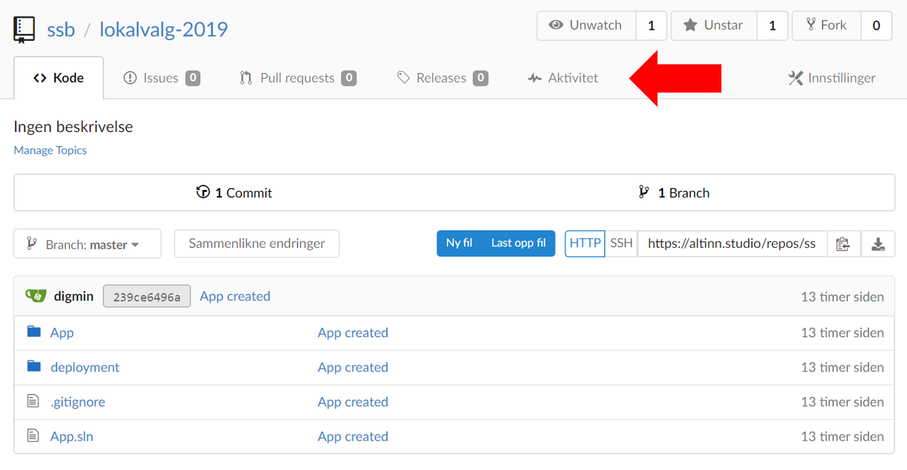

As a user of Altinn Studio, you can utilize differnt tools, depending on your skillset, preferences and the complexity of the app you're developing.
How to navigate inside and across these tools varies.



## Designer

Designer is the tool the tool you start in after logging in on https://altinn.studio.
It is a tool for creating, configuring and deploying apps.

### Navigating to apps
All apps are displayed on the dashboard.
Navigate to a specific app by selecting the app from the dashboard.

If you need to navigate to the app repository from Designer, there's a link in the top right menu.



### Editing an app

There are two navigation menus, a top menu and a menu on the left.  
The **top menu** allows navigation between functional areas of an app.
The **left menu** is used for navigation within each area.


- About (_Om_)
  - About the app
- Developing the app (_Lage_)
  - Data model
  - UI-Editor
  - Access control
- Languages (_Språk_)
  - Texts
- Deploy

## Repos
Repos is the tool where the apps are stored as Git repositories, and it can be found on https://altinn.studio/repos.

### Main menu


The main top menu in repos contains these elements:

- Altinn logo - back to the Altinn Studio start page.
- Dashboard - Lists your activities and the repositories and organisations you have access to. Also lets you change dashboard.
- Issues - Lists open and closed issues relevant for you.
- Pull requests - Lists open and closed pull requests relevant for you.
- Explore (_Utforsk_) - Let you browse all repositories, users and organistions.
  - Repositories
  - Users
  - Organisations


### Navigating inside a repository
After navigating to a repository, a new set of menus appear that are relevant for the current app repository.



- Code - the content, all files that an app consists of.
- Issues - in this repo
- Pull Requests - for this repo
- Releases - created from this repo
- Activity - in this repo

If you need to navigate back to the Designer from a repository, a new top-level menu item is available:


## Code
Even though you can edit code and config files directly in Altinn Studio Repos, it is much more convenient to do this locally on your own machine.

To do this you need to [download and install a code editor](https://code.visualstudio.com/Download).  
We recommend [Visual Studio Code](https://code.visualstudio.com/), but that's up to you.

### Find the repo address
The URL to a given app repository is like this, where you change owner and reponame:  
`https://altinn.studio/repos/owner/repo.git`.

Ypu can find the URL to use if you navigate to a repository. Click the icon to the right to copy.


You can also find the same URL in a popup in Designer if you press the "Clone" button.


### Clone the code
After you open Code, open the [integrated terminal](https://code.visualstudio.com/docs/editor/integrated-terminal) (ctrl + ø) and type the clone command.
Remember to type the correct owner and repo.

```sh
git clone https://altinn.studio/repos/owner/repo
```

If you're not familiar with Code or the Git workflow, there are some good documentation here:

https://code.visualstudio.com/docs/getstarted/introvideos
https://code.visualstudio.com/docs/editor/versioncontrol#_git-support