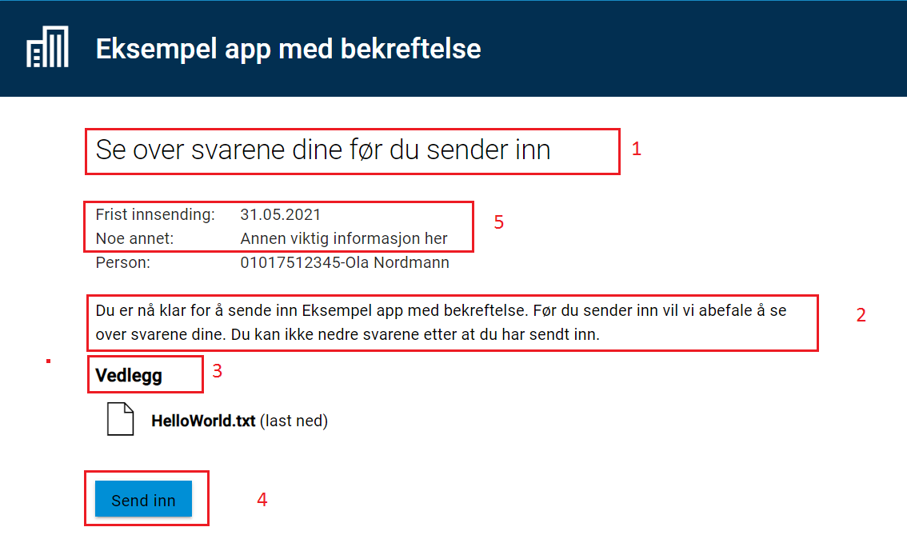
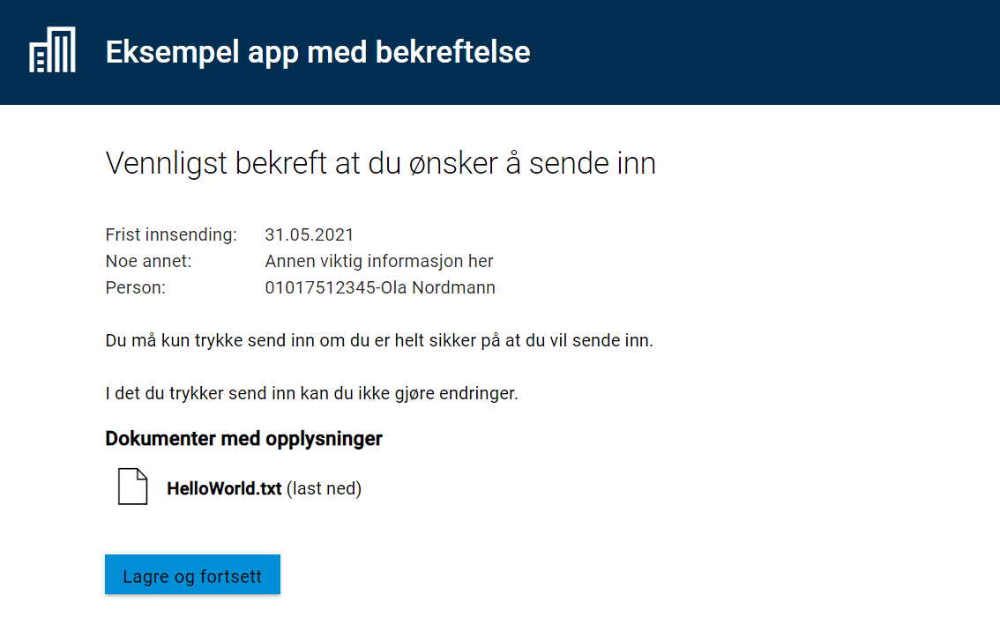

En applikasjon vil ha en prosess som brukeren av applikasjonen vil følge. 
Avhengig av hvilken type steg brukeren er i, vil forskjellige ting vises. 
Denne siden vil forklare hvordan visningen til de forskjellige stegene kan tilpasses.

## Data (Data) (Tilsvarer utfyllingssteg i Altinn II)
I denne prosess-task-typen vises skjema som kan fylles ut. Skjema kan redigeres ved bruk av [UI editoren](../../ui-editor).

## Bekreftelse (Confirmation)
I denne prosess-task-typen vises noen standard-tekster, og bruker kan velge å *bekrefte* for å gå videre.

Tekstene kan overstyres, ved at man legger inn tekstnøkkel som hører til hver tekst i språkfilene for appen. Info
om hvordan dette gjøres finner du [her](../../texts). Se under for oversikt over de forskjellige tekstnøklene som kan
overstyres.

I tillegg kan man legge inn statisk data som kan presenteres til sluttbruker, markert med *5* i bildet under. 



### Overstyre tekster
<table>
  <thead>
    <tr>
      <th>Tekst nr. (se bilde over)</th>
      <th>Tekstnøkkel</th>
    </tr>
  </thead>
  <tbody>
    <tr>
      <td>1</td>
      <td>confirm.title</td>
    </tr>
    <tr>
      <td>2</td>
      <td>confirm.body</td>
    </tr>
    <tr>
      <td>3</td>
      <td>confirm.attachments</td>
    </tr>
    <tr>
      <td>4</td>
      <td>confirm.button_text</td>
    </tr>
  </tbody>
</table>

Eksempel på overstyrte tekster i filen `resources.nb.json`:

```
{
  "id": "confirm.title",
  "value": "Vennligst bekreft at du ønsker å sende inn"
},
{
  "id": "confirm.body",
  "value": "Du må kun trykke send inn om du er helt sikker på at du vil sende inn. <br/><br/>I det du trykker send inn kan du ikke gjøre endringer."
},
{
  "id": "confirm.attachments",
  "value": "Dokumenter med opplysninger"
},
{
  "id": "confirm.button_text",
  "value": "Lagre og fortsett"
}
```

Merk at i eksempelet over har vi brukt html-taggen `<br/>` for å lage linjeskift. Andre html-tags som støttes er *lenke*(`<a></a>`) og *uthev*(`<b></b>`), disse kan
brukes til å formattere tekst.

Dette resulterer i følgende visning:


### Presentere statisk data til sluttbruker
Det kan være behov for å presentere strukturert data til sluttbruker i tillegg til de tekstene som kan overstyres. Det kan gjøres ved 
å legge inn presentasjonsfelter med statiske data. I eksempelet som vises markert med *nr. 5*, så er det lagt inn 2 sett med presentasjonsfelter. 
I tillegg vises alltid feltet for avgiver. 

Presentasjonsfelter legges inn i `applicationMetadata.json` som ligger under `App/config`. Følgende attributter legges inn per presentasjonsfelt:

<table>
  <thead>
    <tr>
      <th>Navn på attributt</th>
      <th>Beskrivelse</th>
    </tr>
  </thead>
  <tbody>
    <tr>
      <td>id</td>
      <td>Et unikt navn, for å kunne skille presentasjonsfeltene fra hverandre.</td>
    </tr>
    <tr>
      <td>textResouce</td>
      <td>Nøkkelen til tekstressursen som er knyttet til feltet. Dette er teksten som vises på venstre side.</td>
    </tr>
    <tr>
      <td>value</td>
      <td>Den statiske verdien som skal vises, vises på høyre side.</td>
    </tr>
    <tr>
      <td>taskIds</td>
      <td>Liste over id'ene til de prosess-tasks der presentasjonsfeltet skal vises. Per nå støttes dette kun for Bekreftelse.</td>
    </tr>
  </tbody>
</table>

Eksempel på definisjonen av presentasjonsfelter som vises i bildene over:

```
"presentationFields": [
    {
      "id": "deadline",
      "textResource": "confirm.deadline",
      "value": "31.05.2021",
      "taskIds": ["Task_2"]
    },
    {
      "id": "",
      "textResource": "Noe annet",
      "value": "Annen viktig informasjon her",
      "taskIds": ["Task_2"]
    }
  ]
```