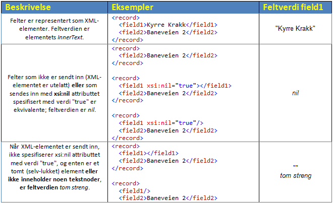
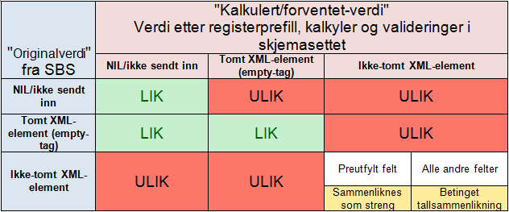
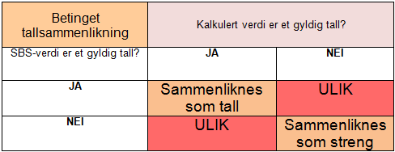

Ved innsending fra sluttbrukersystem skal i utgangspunktet følgende tre prinsipper gjelde etter innføring av 18550:

- Altinn skal ikke endre på skjemasettet som blir sendt inn av SBS.
- Altinn kan imidlertid tilføye kalkulerte felter som SBS *unnlater* å sende inn (eller sender inn uten verdi, se punkt XML og syntaks-konvensjoner.
- Skjemasett med feil skal i utgangspunktet stoppes av Altinn og innsending skal feile.

Det andre prinsippet åpner for at SBS kan benytte seg av kalkyler og registerprefill som er bygget inn i skjemasettet ved å unnlate å sende inn de aktuelle feltene. Altinn vil da tilføye feltene med beregnet eller forhåndsutfylt verdi. Kvitteringen til SBS vil indikere alle felter som ikke ble sendt inn fra SBS, men ble tilføyd av Altinn og sendt videre til tjenesteeier. Feltverdien (fra kalkyle eller prefill) er også angitt i kvitteringen.

Merk imidlertid at SBS kan hente prefilldata selv dersom disse skal benyttes. Denne metoden er mer robust ettersom den ikke krever kunnskap om hvilke felter som har prefilldata. Man vil da verken få advarsel eller feil på registerprefill-felter.

Tjenesteeier har mulighet til å fravike det tredje prinsippet ved å definere *overstyrbare felter*. Overstyrbare felt vil kun gi advarsel ved ulik verdi (ikke feilmelding). Tjenesteeier kan også fravike fra det tredje prinsippet ved å bruke opsjonen "Kun XSD-validering". Dersom et skjema har kun XSD-validering vil verken sammenlikningsreglene beskrevet i dette vedlegget eller eventuelle valideringer og kalkyler i skjemaet kjøres for skjemaet ved innsending fra SBS.

Sammenlikning av skjemasett
---------------------------

Når SBS sender inn et skjemasett tar Altinn en kopi av innsendingen. Kopien gjennomgår så samme behandling som innsendinger i SBL, hvilket medfører at denne kopien modifiseres; felter kan bli lagt til eller skrevet over. Det kan også resultere i advarsler eller feil fra skjemamotoren (valideringsfeil i skjemaet, for eksempel at et påkrevd felt mangler eller at organisasjonsnummer ikke er oppgitt på et gyldig format).

Altinn sammenlikner deretter den modifiserte kopien av skjemasettet med den innsendte originalen. I hovedsak består dette i å sammenlikne felt for felt de to versjonene. Når feltverdier er ulike fører det til en feil (slik at innsending feiler) eller advarsel (når feltet er flagget som overstyrbart). Hva dette betyr er mer presist definert i det påfølgende.

Funksjonaliteten
----------------

Endringen har blitt implementert som en modul som kjøres under komplett innsending fra SBS. Denne vil kjøre i tillegg til de vanlige modulene (XSD-validering, instansiering av skjema med kjøring av valideringer, kalkuleringer og dynamikk, prefill-validering). Tidspunktet 18550-modulen kjøres er etter instansiering av skjema.

- Opprinnelig XML for skjema sendes inn fra sluttbrukersystem (SBS).
- XSD validering av opprinnelig XML utføres. Dersom XSD validering feiler så gis det en god, tydelig og   informativ valideringsfeil til SBS og innsending feiler.
- XSD-valideringen er nå en fullstendig XSD-validering i motsetning til tidligere hvor tomme element alltid ble godtatt uansett type (Integer, decimal, string, osv).   b.  Dersom XSD validering er ok så fortsetter prosessen til neste validering steg.
- Altinn kjører nå kalkyler basert på innsendte data fra SBS. Deretter sammenlignes verdiene fra SBS med de       kalkulerte verdiene (registerprefill, verdioverføringer, kalkyler) fra Altinn.
- Resultatet av sammenligningen resulterer i en liste med feil og advarsler som vises i kvitteringen.
- Merk at advarsler ikke resulterer i at innsending stoppes, men er kun ment som informasjon at noe er ulikt       det som forventes. Sluttbrukersystem trenger ikke å agere på dette ved mindre de oppdager at innsendte data     faktisk er feil.
- Det er opp til tjenesteeier å bestemme hvilke felter som skal gi advarsel eller feilmelding ved ulik verdi.      Overstyrbare felter vil resultere i advarsel.

XML og syntaks-konvensjoner
---------------------------

Reglene er formulert med begrepene felt og feltverdi. Det er derfor nyttig å først relatere disse begrepene til XML-representasjonen. Noen ganger finnes det mer enn én måte å representere det samme på.

Tabellen under oppsummerer syntaks-konvensjonene.

Like og ulike feltverdier
-------------------------

Nedenstående tabell oppsummerer hvordan Altinn bedømmer feltverdier som like eller ulike.

Dette er for det meste som man ville forvente, men med et par unntak det er verdt å merke seg:

- Dersom SBS sender inn tom streng men "InfoPath-verdi" er *nil* betraktes dette som likt - men det omvendte er ikke tilfellet. (Årsaken til dette er at InfoPath endrer *alle* felter med tom streng til NIL.)
- Preutfylte felter sammenliknes alltid som strenger (case insensitivt).
- Andre felter sammenliknes med en betinget tallsammenlikning når det er mulig (oppsummert i tabell under). Betinget tallsammenlikning betyr at "4.0", "4" og "0004.00" alle betraktes som like. Merk imidlertid at XSD som regel begrenser hva slags tallrepresentasjoner som er tillatte!

Betinget tallsammenlikning kan oppsummeres som følger:

Tabellen nedenfor oppsummerer når det gis feil eller advarsel, samt hva som sendes til tjenesteeier.

| XML er i henhold til XSD | Kun XSD-validering | Ulik feltverdi | Overstyrbart felt | Resultat        | Hva sendes til tjenesteeier|
|--------------------------|--------------------|----------------|-------------------|-----------------|---------------|
| Nei                      | N/A                | N/A            | N/A               | Feil            | ingenting (innsending feiler)                                                                                    |
| Ja                       | Ja                 | N/A            | N/A               | OK              | Innsendt verdi fra SBS.                                                                                          |
| Ja                       | Nei                | Nei            | N/A               | OK              | Innsendt verdi fra SBS.                                                                                          |
| Ja                       | Nei                | Ja             | Ja                | Advarsel        | Innsendt verdi fra SBS hvis denne eksisterer (feltverdi <> nil), ellers Altinn-beregnet verdi.*)                 |
| Ja                       | Nei                | Ja             | Nei               | Feil/Advarsel*) | ingenting (innsending feiler) Altinn-beregnet Verdi hvis SBS ikke angir påstand ved å utelate XML-element/nil *) |

N/A = har ingen betydning.

- Merk at Altinn kan legge til data i kalkyler og preutfylte felt utover det SBS har sendt inn hvis følgende scenario er tilstedet:\ SBS har ikke sendt inn en påstand (XML element ikke tilstedet/NIL uavhengig om feltet er satt til overstyrbart eller ikke av Tjenesteeier. Det vil da bli gitt en Advarsel til SBS i kvittering.
- Merk at dette er i tillegg til feil og advarsler som kommer fra valideringsregler i skjemasettet (myke valideringer gir advarsel, harde valideringer gir feil).

I praksis
---------

I praksis vil 18550-endringen by på mindre til ingen endringer for sluttbrukersystemene. Det sluttbrukersystemleverandørene må ta høyde for nå er at det kan komme advarsler i kvitteringer på innsendinger som har blitt instansiert korrekt. Advarslene vil komme på samme måte som myke skjemavalideringer og må eventuelt presenteres for brukeren av systemet. Feilmeldinger som blir produsert av denne 18550-endringen vil komme på samme måte som vanlige skjemavalideringsfeil og innsendingen vil stoppes.

Sluttbrukersystem brukerne vil nok ikke merke store forskjellen fra tidligere. De vil oppleve å få tilbake mer informasjon i kvitteringen enn tidligere.

Kjente feil/mangler for SBS
---------------------------

- Det blir gitt en advarsel hvis grupper i XML er utelatt.
- Ikke språkstøtte på advarsel og feilmelding i kvittering
