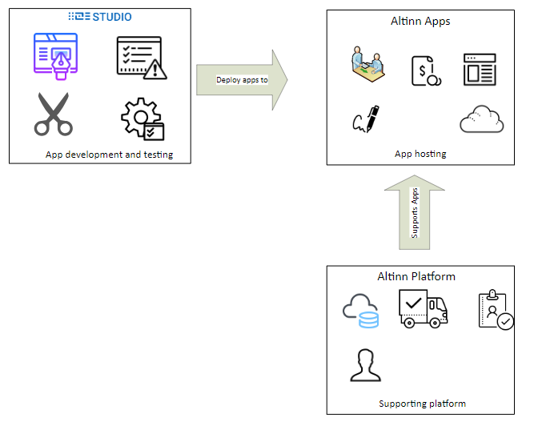

Overordnet roadmap for videreutvikling av Altinn i 2019.

## Q1 - 2019

### :heavy_check_mark: Tilby bruker mulighet til å definere "mine favoritt-aktører" for å lette aktørvalg i pålogging
I dag får bruker med mange aktører presentert alle aktører hvor de mest brukte aktørene står øverst. Konseptet "mest brukte aktører" skal fjernes og i stedet vil det tilbys funksjonalitet for å legge til - og fjerne favorittaktører.
Dette ble [levert i release 19.3](/docs/releases/2019/19-3/#mulighet-for-opprettelse-av-favorittliste).

## Q2 - 2019

### Altinn skytjenester
Det skal etableres Altinn testmiljø i sky. Miljøene skal benyttes til å teste tjenester utviklet i Altinn Studio, samt endringer i sluttbrukerløsningen

### Nasjonal tjeneste for dokumentasjonsbevis - eBevis
Det skal etableres en [løsning](/docs/guides/nadobe/) for innhenting av dokumentasjonsbevis fra leverandør.

### Forenkle administrasjon av lokal rolle med mange rettigheter
Prosessen med å legge til nye tjenester i en lokal rolle forenkles. I stedet for å måtte legge til en og en tjeneste skal administrator kunne legge til flere tjenester i en operasjon. Det vil også bli mulig å administrere flere tjenester i samme skjermbilde. Eier av tjenesten skal også vises i søkevinduet slik at det er lettere å velge riktig tjeneste.

### Ny innlesing av Enhetsregisteret
Følgende skal utføres:

1. Tilpasning/utvidelse av [Enhetsregisteret](https://www.brreg.no/om-oss/oppgavene-vare/alle-registrene-vare/om-enhetsregisteret/) i Altinn
2. Full re-innlesing av Enhetsregisteret i Altinn

## Q3 - 2019

### Altinn Studio / Altinn Apps / Altinn Platform (tidligere kjent som Tjenester 3.0) - "minimum viable product" (MVP)
Det skal etableres to nye løsninger - Altinn Studio (en ny tjenesteutviklingsløsning) og Altinn Apps (kjøretidsløsning for de nye tjenestene).  
Altinn Studio og Altinn Apps utvikles smidig og endringer tilgjengeliggjøres fortløpende på https://altinn.studio. 
Funksjonalitet for å utvikle en tjeneste og teste den i et testmiljø (i sky) vil komme i Q2, og mulighet for å kjøre reelle tjenester i produksjon i Q3.

Både [koden](https://github.com/Altinn/altinn-studio) og [backlog for videreutvikling](https://github.com/Altinn/altinn-studio/issues) ligger åpent på GitHub,
og alle kan [opprette bugs, stille spørsmål eller komme med forslag til forbedringer](https://github.com/Altinn/altinn-studio/issues/new/choose).

MVP-en vil bestå av:

#### Altinn Studio som tjenesteutviklingsverktøy
Altinn Studio er erstatningen for dagens TUL-løsning. (Dagens TUL-løsning vil være tilgjengelig i parallell med Altinn studio til alle relevante tjenester er flyttet over - seinest 2029.) I MVP-en av dette verktøyet skal det etableres funksjonalitet for å sette opp en tjeneste som tilsvarer enkle tilfeller av dagens innsendingstjenester. Deler av tjenesteutviklingen (f.eks. oppsett av regler) vil kreve programmeringskompetanse.

#### Altinn Apps (runtime-løsning for Altinn Studio-tjenester)
Tjenestene som etableres i Altinn Studio vil kjøre i et separat runtime-miljø i sky. Dette vil ha den nødvendige funksjonaliteten for å tilgjengeliggjøre de ferdig utviklede tjenestene. Å migrere en tjeneste til Altinn Apps kan tjenesteeier gjøre selv.

#### Kunne gjenbruke eksisterende grensesnitt (Altinn Platform)
For at tjenesteeiere skal kunne motta data fra en tjeneste i Tjenester 3.0, trenger de et grensesnitt å motta data på. For MVP er det besluttet at den raskeste / mest fornuftige veien til mål er å tilby å kunne gjenbruke dagens grensesnitt (med minimale justeringer).

#### Kunne hente data fra dagens SBL som del av tjeneste (Altinn Platform)
For å kunne tilby bl.a. prefill i en tjeneste, vil det gjøres endringer i Altinn II slik at Altinn Studio-tjenestene får tilgang på de nødvendige dataene. Det blir lagd en egen Altinn Studio <-> Altinn II kommunikasjonsmodul som blir del av Altinn II-løsningen, og at denne kommuniserer videre med de delene av Altinn II som det er relevant å hente data fra (profil og register).

### Utfasing av støtte for TLS 1.1 og 1.0
Støtte for TLS 1.0 og 1.1 skal fjernes for all inngående trafikk til Altinn. Altinn vil kun støtte inngående trafikk basert på TLS 1.2. Driftsvarsling er sendt ut til tjenesteeiere og sluttrbukersystemleverandører.

### Forbedre logging av tjenesteeiers bruk av løsningen
Det skal etableres bedre logging av tjenesteeiers bruk av løsningen. For å støtte opp under en evt ny forretningsmodell for Altinn vil vi få på plass en bedre logging av tjenesteeiers bruk av løsningen. Dette omfatter bruk av melding-, skjema-, innsyn-, autorisasjon/lenke-, integrasjons- og varslingstjeneste.

### Konsolidering av brukere med D-nummer
Det skal etableres en løsning slik at bruker med [D-nummer](https://www.skatteetaten.no/person/utenlandsk/norsk-identitetsnummer/d-nummer/)
som har fått fødselsnummer skal kunne få tilgang til det som lå i innboks/arkiv på D-nummer samt kunne videreføre en skattedialog som ble startet på D-nummer.

### Erstatte /api/help med dokumentasjon på Altinndocs
/api/help i REST-APIet skal avvikles. I stedet skal dokumentasjon av REST-APIet legges ut på Altinn Docs. Dette vil blir tilrettelagt gjennom at det skal etableres en offentlig tilgjengelig OpenAPI 3.0-spesifikasjon som blir lagt til grunn for å generere dokumentasjon.

Målsetning med endringen er å oppnå enklere vedlikehold av dokumentasjon av REST-API
## Q4 - 2019

### "Proffversjon" av innboks
Som proffbruker av Altinn skal det kunne være mulig å tilpasse innboksen slik at den bedre ivaretar behovene, samt legger til rette
for at en skal kunne gjøre fleksible søk på tvers av aktører.
